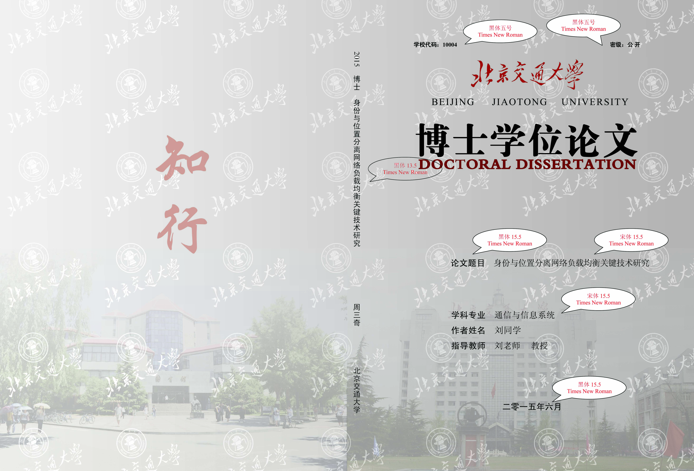

# 北京交通大学研究生学位论文撰写规范及模板

本项目为北京交通大学研究生（博士、硕士）学位论文撰写规范及模板的资源集合，方便师生快速获取和使用最新版本模板及相关规范。（所以内容均来源于：https://gs.bjtu.edu.cn/cms/item/195.html）

---

## 📜 1. 撰写规范

本规范依据中华人民共和国国家标准《学位论文编写规则》(GB/T 7713.1-2006)制定，具体见 [《北京交通大学研究生学位论文撰写规范》](./北京交通大学研究生学位论文撰写规范.pdf)。

---

## ⬇️ 2. 模板下载

以下为提供的模板列表：

### 📘 Word 模板

- **学硕**：[北京交通大学学术硕士学位论文模板](模板/word/北京交通大学学术硕士学位论文模板.doc)
- **专硕**：[北京交通大学硕士专业学位论文模板](模板/word/北京交通大学硕士专业学位论文模板.doc)（2023年04月更新）
- **学博**：[北京交通大学学术博士学位论文模板](模板/word/北京交通大学学术博士学位论文模板.doc)（2021年11月更新）
- **专博**：[北京交通大学博士专业学位论文模板](模板/word/北京交通大学博士专业学位论文模板.doc)

### 📗 LaTeX 模板

**单面论文模板**：适用于单面打印的论文。
  - Mac
    - [博士学硕](模板\latex\Latex-单面论文模板\MAC\bjtu-thesis-master-MAC-博士学硕-单页.zip)
    - [专硕-不含工程](模板\latex\Latex-单面论文模板\MAC\bjtu-thesis-master-MAC-专硕-不含工程-单页.zip)
    - [专硕](模板\latex\Latex-单面论文模板\MAC\bjtu-thesis-master-MAC-专硕-单页.zip)
  - Win
    - [博士学硕](模板\latex\Latex-单面论文模板\Win\bjtu-thesis-master-WIN-博士学硕-单页.zip)
    - [专硕-不含工程](模板\latex\Latex-单面论文模板\Win\bjtu-thesis-master-WIN-专硕-不含工程-单页.zip)
    - [专硕](模板\latex\Latex-单面论文模板\Win\bjtu-thesis-master-WIN-专硕-单页.zip)
- **双面论文模板**：适用于双面打印的论文。
    - [博士](模板\latex\Latex-双面论文模板\01_北京交通大学博士论文模板.zip)
    - [硕士](模板\latex\Latex-双面论文模板\02_北京交通大学硕士论文模板.zip)
    - [专硕](模板\latex\Latex-双面论文模板\03_北京交通大学专业硕士论文模板.zip)

---

## ⚒️ 3. 使用指南

### 📘 Word 模板

下载对应模板后，直接按照规范填写内容，注意页眉页脚和封面格式是否符合要求。

### 📗 LaTeX 模板

1. 下载 LaTeX 模板压缩包。
2. 按需选择单面或双面模板。
3. 参考 [LaTeX模板简易使用教程](/模板/latex/LaTeX模板简易使用教程.pdf) 进行编辑。
4. 编译生成 PDF 文件（可使用 [Overleaf](https://overleaf.com/) 在线编译）。

---

## 📎 附件资源

- **博士专业学位论文外封面（灰色渐变）**：[PDF 下载](附件/博士专业学位论文外封面（灰色渐变）.pdf)

- **博士学位论文外封面（灰色渐变）**：[JPG 下载](附件/博士学位论文外封面（灰色渐变）.jpg)

- **学术硕士学位论文外封面（浅黄渐变）**：[JPG 下载](附件/学术硕士学位论文外封面（浅黄渐变）.jpg)

- **硕士专业学位论文封皮（蓝色渐变）**：[PDF 下载](附件/硕士专业学位论文封皮（蓝色渐变）.pdf)

---

### 许可协议

本仓库仅作同步镜像备份使用，不对规范及模板内容做任何修改。如有侵权，请联系我们删除。如有任何问题，请访问研究生院官网联系对应老师：https://gs.bjtu.edu.cn/cms/item/195.html